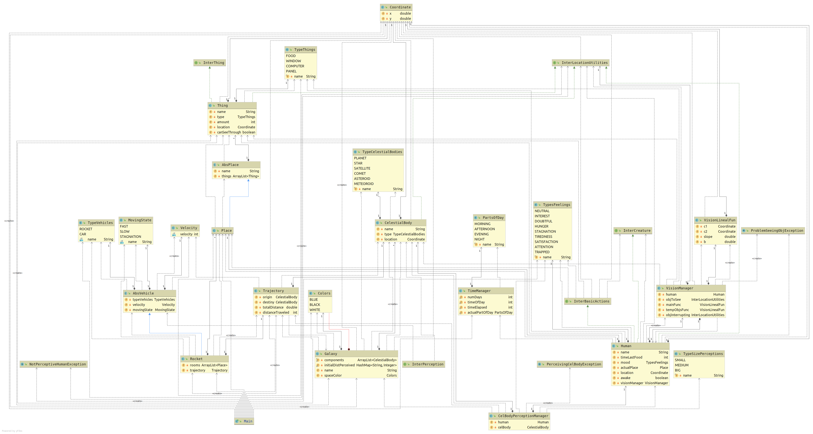

# P_LAB3_2019

Реализация сказки по определенному тексту для практики с языком Java:

> Хотя ракета мчалась со страшной скоростью, покрывая пространство в двенадцать километров в одну секунду, Незнайке казалось, что она застыла на месте и ни на полпальца не приближается к Луне. Это объяснялось тем, что расстояние от Земли до Луны очень большое -- около четырехсот тысяч километров. При таком огромном расстоянии скорость двенадцать километров в секунду не так велика, чтоб ее можно было заметить на глаз, да еще находясь в ракете. Прошло два или три часа, а Незнайка все смотрел на Луну и никак не мог от нее оторваться. Луна словно притягивала к себе его взоры. Наконец он почувствовал какое-то мучительное посасывание в животе и только тогда сообразил, что наступила пора обедать. Он поскорей спустился в пищевой отсек и увидел, что Пончик проснулся и уже что-то жует с аппетитом.

> Aunque el cohete corrió a una velocidad terrible, cubriendo un espacio de doce kilómetros en un segundo, no sabía que se había estancado en su lugar y no se acercaba a la Luna en medio dedo. Esto se debe al hecho de que la distancia de la Tierra a la Luna es muy grande - alrededor de cuatrocientos mil kilómetros. Con una distancia tan grande, la velocidad de doce kilómetros por segundo no es tan grande que se puede ver en el ojo, y mientras está en el cohete. Han pasado dos o tres horas, y no sé todo el mundo estaba mirando la Luna y no podía escapar de ella. La Luna parecía atraída por sus ojos. Por último, sintió algún tipo de succión dolorosa en el estómago y sólo entonces se dio cuenta de que era hora de cenar. Él bajó rápidamente al compartimiento de alimentos y vio que el Donut se despertó y ya algo mastica con el apetito.

